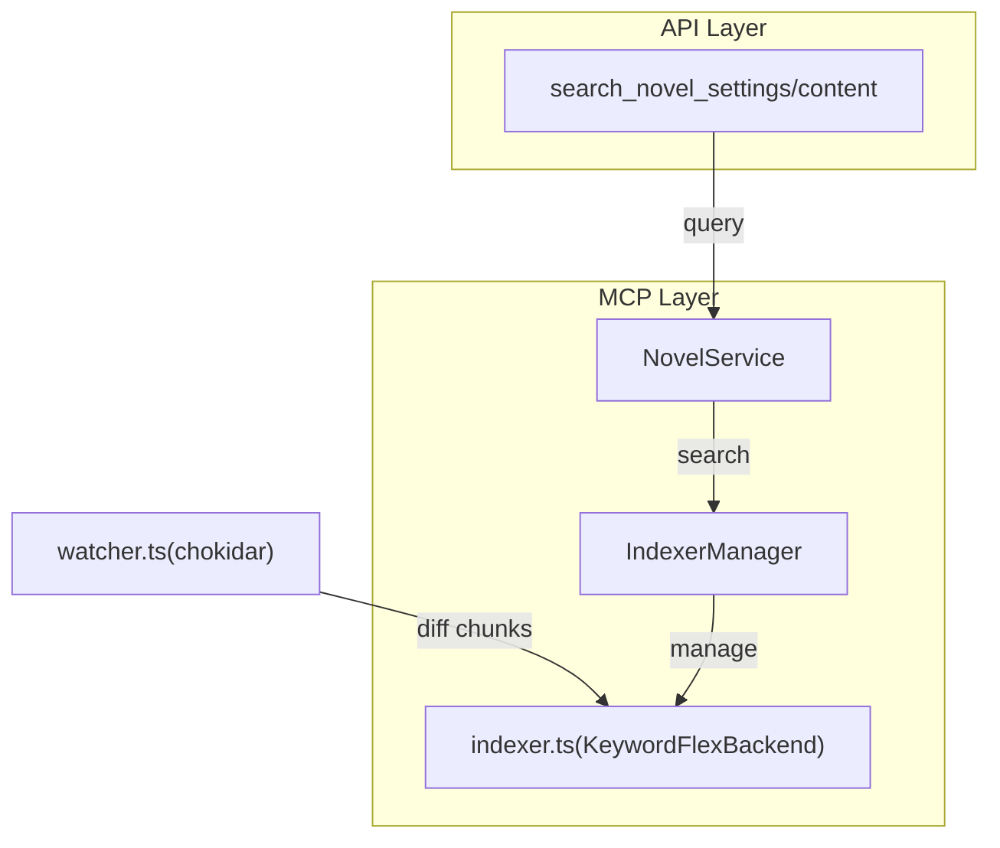

# Dialogoi ― フェーズ 1 インストラクションファイル

> **対象範囲** FlexSearch だけを用いた Retrieval-Augmented Generation (RAG) ツールチェーンを実装する。
> 本書はフェーズ 2（Qdrant ハイブリッド検索）開始までの **単一の信頼ソース** とする。

---

## 1 高レベル目標

1. **全文検索 RAG MVP** - 自然言語クエリから関連テキストチャンク（ID とスニペット）を返す。
2. **外部依存ゼロ** - Docker / GPU を一切使わず Node.js ≥ 20 だけで動作。
3. **ホットリロード** - プロジェクトファイルの変更をリアルタイムでインデックスに反映。
4. **将来拡張** - 公開 API を固定し、後で Qdrant バックエンドを差し込める。

---

## 2 アーキテクチャ概要



- **`watcher.ts`** ― ファイルシステム監視。追加 / 変更 / 削除イベントを発火。（実装予定）
- **`indexer.ts` / KeywordFlexBackend** ― FlexSearch `Document` インデックスを生成・維持する。
- **`NovelService`** ― 小説プロジェクト管理とMCPツールの実装。
- **`IndexerManager`** ― 複数の小説プロジェクトのインデックスを管理。

> **注** バックエンドは `SearchBackend` 抽象を介して呼び出す。フェーズ 2 で `HybridBackend` を差し替えても呼び出し側は無変更。

---

## 3 データモデル

### 3.1 Chunkクラス

```ts
export class Chunk {
  constructor(
    public title: string, // 章・節タイトル
    public content: string, // チャンク本文
    public filePath: string, // ファイルパス
    public startLine: number, // 開始行番号
    public endLine: number, // 終了行番号
    public chunkIndex: number, // チャンク番号
    public novelId: string, // 小説プロジェクトID
    public tags?: string[], // オプションのタグ
  ) {}

  get baseId(): string; // ハッシュなしのベースID
  get id(): string; // ハッシュ付きの一意ID
  get hash(): string; // タイトル+コンテンツのMD5ハッシュ（8文字）
}
```

### 3.2 WordDocument（形態素解析結果）

| フィールド | 型       | 説明               |
| ---------- | -------- | ------------------ |
| `id`       | `number` | ユニークID         |
| `word`     | `string` | 表層形             |
| `basic`    | `string` | 基本形             |
| `reading`  | `string` | 読み（カタカナ）   |
| `pos`      | `string` | 品詞               |
| `chunkId`  | `string` | 所属チャンクID     |
| `novelId`  | `string` | 小説プロジェクトID |

**FlexSearch 設定（KeywordFlexBackend）**

```ts
document: {
  id: 'id',
  index: [
    { field: 'word', tokenize: 'reverse' },     // 前後部分一致
    { field: 'basic', tokenize: 'reverse' },    // 基本形検索
    { field: 'reading', tokenize: 'reverse' }   // 読み検索
  ],
  tag: ['chunkId', 'filePath', 'novelId'],
  store: true
}
```

---

## 4 依存ライブラリ

| パッケージ                  | バージョン | 用途                       |
| --------------------------- | ---------- | -------------------------- |
| `flexsearch`                | ^0.8.2     | 全文検索 (Document Search) |
| `kuromojin`                 | ^3.0.1     | 日本語形態素解析           |
| `@modelcontextprotocol/sdk` | ^1.12.3    | MCPサーバー実装            |
| `dotenv`                    | ^16.4.5    | 環境変数管理               |
| `zod`                       | ^3.25.67   | スキーマ検証               |

Node 20 以上で標準機能を活用。

---

## 5 プロジェクト構成

```
dialogoi/
├─ src/
│  ├─ backends/
│  │   ├─ SearchBackend.ts      # 抽象インターフェース
│  │   └─ KeywordFlexBackend.ts # 形態素解析ベース実装
│  ├─ services/
│  │   └─ novelService.ts       # 小説プロジェクト管理
│  ├─ lib/
│  │   ├─ chunker.ts            # 再帰チャンク化ヘルパ
│  │   ├─ morphAnalyzer.ts      # 日本語形態素解析
│  │   ├─ indexerManager.ts     # インデックス管理
│  │   └─ config.ts             # 設定管理
│  ├─ utils/
│  │   └─ fileUtils.ts          # ファイル操作ユーティリティ
│  ├─ domain/
│  │   └─ novel.ts              # ドメインモデル
│  ├─ dto/
│  │   └─ novelDto.ts           # MCPレスポンス型定義
│  ├─ indexer.ts                # 単一インデックス管理
│  └─ index.ts                  # MCPサーバーエントリポイント
├─ config/
│  └─ dialogoi.config.json      # 設定ファイル
├─ novels/                      # 小説プロジェクトディレクトリ
│  ├─ sample_novel/
│  └─ mystery_story/
└─ test/
   └─ *.test.ts                 # vitest テストファイル
```

---

## 6 ワークフロー

### 6.1 起動時

1. `dialogoi.config.json` をロード（コマンドライン引数で上書き可能）。
2. MCPサーバーとして起動、NovelServiceが小説プロジェクトを検出。
3. IndexerManagerが各プロジェクトのインデックスを管理（遅延初期化）。

### 6.2 インデックス構築（初回検索時）

1. 対象プロジェクトの **`*.md` / `*.txt`** を全走査。
2. `MarkdownChunkingStrategy` でチャンク化（20%オーバーラップ）。
3. `KeywordFlexBackend` で形態素解析 → 単語単位でインデックス。
4. メモリ内に保持（高速検索を実現）。

### 6.3 ライブ更新（実装予定）

1. `watcher.ts` が FS イベントを受信。
2. 差分計算 → 追加／削除チャンクを抽出。
3. `removeByFile()` / `updateChunks()` でメモリ内インデックスを更新。
4. デバウンスで変更を反映。

### 6.4 検索フロー

```
MCPツール → NovelService.searchRag() → IndexerManager → KeywordFlexBackend
```

戻り値:

```ts
{
  id: string,
  score: number,    // 0–1 正規化スコア
  snippet: string,  // マッチ箇所の周辺テキスト
  payload: {
    file: string,
    start: number,
    end: number,
    tags?: string[]
  }
}
```

---

## 7 実装チェックリスト

### フェーズ1完了項目 ✅

- [x] **chunker.ts** ― MarkdownChunkingStrategy (20%オーバーラップ)
- [x] **KeywordFlexBackend.ts** ― 形態素解析ベース全文検索
- [x] **morphAnalyzer.ts** ― kuromojinによる日本語解析
- [x] **indexer.ts** ― 単一プロジェクトのインデックス管理
- [x] **indexerManager.ts** ― 複数プロジェクトの管理
- [x] **novelService.ts** ― MCPツール実装とRAG検索統合
- [x] **fileUtils.ts** ― ファイル操作ユーティリティ
- [x] **config.ts** ― CLI引数対応の設定管理
- [x] **MCPサーバー統合** ― search_novel_settings/content実装

### 実装予定項目 📋

- [x] **fileWatcher.ts** ― chokidarを使ったファイル監視
- [x] **ホットリロード** ― ファイル変更の自動反映

### 現在の進捗状況 (2025-01-14)

**アーキテクチャの主な特徴:**

1. **形態素解析ベース検索** - kuromojinで日本語を解析し、表層形・基本形・読みで検索
2. **MCPサーバー統合** - NovelServiceがMCPツールを提供、既存APIと完全互換
3. **遅延インデックス** - 初回検索時にインデックス構築、メモリ効率的
4. **リアルタイム監視** - chokidarによるファイル変更の自動検知・インデックス更新
5. **抽象化設計** - SearchBackendインターフェースで将来のベクトル検索に対応

**技術的な実装詳細:**

- **FlexSearch Document API** - 単語単位でインデックス、reverse tokenizeで部分一致
- **スニペット生成** - マッチ位置から前後の文脈を抽出（最大240文字）
- **スコアリング** - 品詞による重み付け（名詞1.0、動詞0.8、形容詞0.7）
- **並列チャンク処理** - Promise.allで効率的なインデックス構築
- **ファイル監視** - 500msデバウンス、隠しファイル除外、自動インデックス更新
- **正規表現検索** - 単純検索と正規表現検索の両対応、エラーハンドリング付き
- **型安全性** - any型を排除、TypeScript strictモード準拠

---

## 8 設定例

```json
{
  "vector": "none",
  "projectRoot": "./novels",
  "chunk": {
    "maxTokens": 400,
    "overlap": 0.2
  },
  "flex": {
    "profile": "fast"
  },
  "search": {
    "defaultK": 10,
    "maxK": 50
  }
}
```

コマンドライン引数での上書き例：

```bash
npm run dev -- --project-root ./my-novels --max-tokens 300
```

---

## 9 パフォーマンス目標

| 指標                              | 目標値  |
| --------------------------------- | ------- |
| コールドスタート (50 k チャンク)  | < 3 秒  |
| インクリメンタル更新 (1 ファイル) | < 50 ms |
| 検索レイテンシ (k=10)             | ≤ 10 ms |
| メモリ使用量                      | < 50 MB |

---

## 10 フェーズ2フック ― HybridBackend スケルトン

`backends/HybridBackend.ts` を追加し `SearchBackend` を実装。Qdrant 未起動時は例外を投げ、呼び出し側で FlexBackend へフォールバックできるようにする。

---

## 11 マイルストーン

| 略号   | 期間 (目安) | 内容                                            |
| ------ | ----------- | ----------------------------------------------- |
| **M1** | 1 日        | プロジェクト骨格 & 設定ローダ                   |
| **M2** | 3 日        | チャンク化 + フルインデックス + search_rag 基礎 |
| **M3** | 2 日        | ファイル監視 & 増分更新                         |
| **M4** | 1 日        | ユニットテスト & チューニング                   |
| **M5** | 1 日        | ドキュメント・CI 追加                           |

> _上記は AI コーディング支援を前提とした保守的な見積もりです。_

---

## 12 Appendix ― コマンド

```bash
# 開発モード (ts-node)
npm run dev

# ビルド & バンドル (esbuild → dist/)
npm run build

# 単体テスト実行
npm t
```

---

## 13 リファクタリング計画（2025-01-15追加）

### 13.1 現状の課題と改善方針

#### 主要な問題点

1. **アーキテクチャの課題**
   - 単一Indexerで全小説を管理（スケーラビリティ問題）
   - レイヤー間の密結合（NovelServiceが検索とファイルI/O両方を担当）
   - 責任の混在（KeywordFlexBackendがファイル読み込みも実行）

2. **コード品質の問題**
   - 危険な型アサーション（`null as unknown as IndexerManager`）
   - エラーハンドリングの不統一（throw/console.error/空配列返却の混在）
   - コード重複（ファイル読み込みロジック、検索結果フォーマット等）

3. **パフォーマンスの懸念**
   - 全単語位置をメモリに保持
   - 検索結果のキャッシュなし
   - 大規模データでの効率性問題

### 13.2 リファクタリングフェーズ

#### Phase 1: 基盤整備（優先度：高）

**目標**: 安定性とメンテナンス性の向上

1. **統一エラーハンドリング**
   ```typescript
   // エラー階層の定義
   class DialogoiError extends Error {}
   class ProjectNotFoundError extends DialogoiError {}
   class IndexingError extends DialogoiError {}
   class SearchError extends DialogoiError {}
   ```

2. **ロギングシステム導入**
   ```typescript
   interface Logger {
     debug(message: string, meta?: any): void
     info(message: string, meta?: any): void
     error(message: string, error?: Error, meta?: any): void
   }
   ```

3. **型安全性の改善**
   - 危険な型アサーションの除去
   - strictNullChecksの徹底
   - unknown型の適切な使用

#### Phase 2: アーキテクチャ改善（優先度：高）

**目標**: 責任の分離と拡張性の向上

1. **Repositoryパターンの導入**
   ```typescript
   interface NovelRepository {
     listProjects(): Promise<NovelProject[]>
     getProject(id: string): Promise<NovelProject>
     getSettings(projectId: string): Promise<NovelSettings>
     getContent(projectId: string): Promise<NovelContent>
   }
   ```

2. **検索サービスの分離**
   ```typescript
   interface SearchService {
     search(projectId: string, query: string, options: SearchOptions): Promise<SearchResult[]>
   }
   ```

3. **ファイル操作サービスの抽出**
   ```typescript
   interface FileOperationsService {
     readFile(path: string): Promise<string>
     writeFile(path: string, content: string): Promise<void>
     listFiles(dir: string, extensions: string[]): Promise<string[]>
   }
   ```

#### Phase 3: パフォーマンス最適化（優先度：中）

**目標**: スケーラビリティとレスポンス改善

1. **プロジェクトスコープのIndexer管理**
   ```typescript
   class IndexerFactory {
     private indexers: Map<string, Indexer>
     
     getIndexer(projectId: string): Indexer {
       // 遅延初期化、プロジェクト毎に独立したIndexer
     }
   }
   ```

2. **キャッシュレイヤーの実装**
   ```typescript
   interface CacheService {
     get<T>(key: string): Promise<T | null>
     set<T>(key: string, value: T, ttl?: number): Promise<void>
     invalidate(pattern: string): Promise<void>
   }
   ```

3. **検索結果のストリーミング**
   - 大量結果のページネーション
   - AsyncIteratorによる逐次処理

#### Phase 4: Qdrant統合準備（優先度：中）

**目標**: ベクトル検索への移行準備

1. **埋め込みサービスインターフェース**
   ```typescript
   interface EmbeddingService {
     embed(text: string): Promise<number[]>
     embedBatch(texts: string[]): Promise<number[][]>
   }
   ```

2. **ハイブリッド検索戦略**
   ```typescript
   interface SearchStrategy {
     search(query: string, options: SearchOptions): Promise<SearchResult[]>
   }
   
   class KeywordSearchStrategy implements SearchStrategy {}
   class VectorSearchStrategy implements SearchStrategy {}
   class HybridSearchStrategy implements SearchStrategy {}
   ```

3. **設定構造の拡張**
   ```typescript
   interface VectorConfig {
     enabled: boolean
     provider: 'qdrant' | 'none'
     qdrant?: {
       url: string
       apiKey?: string
       collection: string
     }
     embedding: {
       model: string
       dimensions: number
     }
   }
   ```

### 13.3 実装スケジュール

| フェーズ | 期間（目安） | 優先度 | 依存関係 |
|---------|-------------|--------|----------|
| Phase 1 | 1週間 | 高 | なし |
| Phase 2 | 2週間 | 高 | Phase 1 |
| Phase 3 | 1週間 | 中 | Phase 2 |
| Phase 4 | 1週間 | 中 | Phase 2 |

### 13.4 テスト戦略

1. **単体テスト強化**
   - カバレッジ目標: 80%以上
   - エラーケースのテスト追加
   - モックの適切な使用

2. **統合テスト追加**
   - 検索フロー全体のテスト
   - ファイル監視機能のテスト
   - MCPツールのE2Eテスト

3. **パフォーマンステスト**
   - 大規模データでのベンチマーク
   - メモリ使用量の監視
   - 検索レイテンシの測定

### 13.5 移行戦略

1. **段階的移行**
   - 既存機能を維持しながら新構造を追加
   - フィーチャーフラグによる切り替え
   - ロールバック可能な設計

2. **後方互換性**
   - MCP APIの変更なし
   - 設定ファイルの互換性維持
   - 既存データの移行ツール提供

### 13.6 既知の問題と対処

1. **FlexSearch削除処理の制限**
   - 削除が即座に反映されない問題は既知
   - 現在は削除→再追加で対処
   - Qdrant移行で根本解決予定

2. **テストコードのパス問題**
   - KeywordFlexBackend.test.tsで絶対パス使用箇所あり
   - 本番コードは正常（相対パス使用）
   - Phase 1で修正予定

---

_フェーズ 1 インストラクションここまで_
