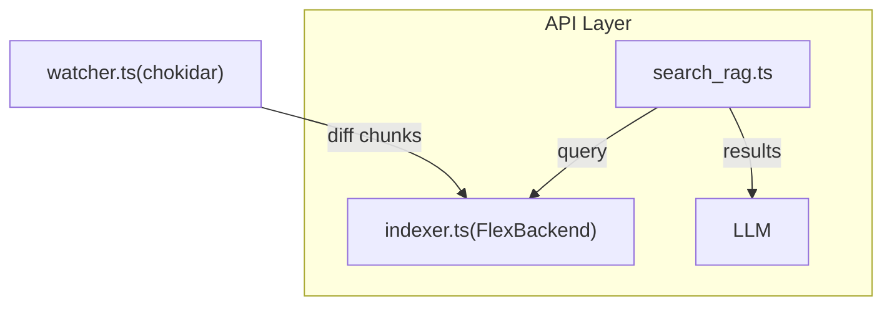

# Dialogoi ― フェーズ 1 インストラクションファイル

> **対象範囲** FlexSearch だけを用いた Retrieval-Augmented Generation (RAG) ツールチェーンを実装する。
> 本書はフェーズ 2（Qdrant ハイブリッド検索）開始までの **単一の信頼ソース** とする。

---

## 1 高レベル目標

1. **全文検索 RAG MVP** - 自然言語クエリから関連テキストチャンク（ID とスニペット）を返す。
2. **外部依存ゼロ** - Docker / GPU を一切使わず Node.js ≥ 20 だけで動作。
3. **ホットリロード** - プロジェクトファイルの変更をリアルタイムでインデックスに反映。
4. **将来拡張** - 公開 API を固定し、後で Qdrant バックエンドを差し込める。

---

## 2 アーキテクチャ概要



- **`watcher.ts`** ― ファイルシステム監視。追加 / 変更 / 削除イベントを発火。
- **`indexer.ts` / FlexBackend** ― FlexSearch `WorkerIndex` を生成・維持する。
- **`search_rag.ts`** ― MCP ツールとして公開。`search_rag(query, k)` を提供。

> **注** バックエンドは `SearchBackend` 抽象を介して呼び出す。フェーズ 2 で `HybridBackend` を差し替えても呼び出し側は無変更。

---

## 3 データモデル

| フィールド | 型         | 説明                                                         |
| ---------- | ---------- | ------------------------------------------------------------ |
| `id`       | `string`   | `file::section::para-N::chunk-M[@hash]` ― グローバル一意キー |
| `title`    | `string`   | 章・節タイトル（重み付け 3）                                 |
| `content`  | `string`   | チャンク本文（200–400 トークン）                             |
| `tags`     | `string[]` | オプション ― 例: `伏線:追跡装置`                             |

**FlexSearch 設定例**

```ts
profile: "fast",
document: {
  id: "id",
  index: [
     { field: "title",   tokenize: "forward", weight: 3 },
     { field: "content", tokenize: "reverse", weight: 1 }
  ],
  store: ["title", "content", "tags"]
}
```

---

## 4 依存ライブラリ

| パッケージ            | バージョン | 用途                      |
| --------------------- | ---------- | ------------------------- |
| `flexsearch`          | ^0.7.0     | 全文検索 (Worker モード)  |
| `chokidar`            | ^3.5       | ファイル監視              |
| `ts-node` / `esbuild` | latest     | dev ランタイム / バンドル |

Node 20 以上で `worker_threads` が標準利用可能。

---

## 5 プロジェクト構成

```
Dialogoi/
├─ src/
│  ├─ backends/
│  │   ├─ SearchBackend.ts      # 抽象 IF
│  │   └─ FlexBackend.ts        # フェーズ1実装
│  ├─ tools/
│  │   └─ search_rag.ts         # MCP ツール
│  ├─ lib/
│  │   ├─ chunker.ts            # 再帰チャンク化ヘルパ
│  │   └─ watcher.ts            # chokidar ラッパー
│  └─ indexer.ts                # インデックス管理
├─ config/
│  └─ dialogoi.config.json
└─ test/
   └─ search_rag.spec.ts
```

---

## 6 ワークフロー

### 6.1 起動時

1. `dialogoi.config.json` をロード（コマンドライン引数で上書き可能）。
2. `cache/index.json` が存在すれば `importIndex()`。
3. 無ければ **`*.md` / `*.txt`** を全走査 → `chunker.ts` → `add()`。
4. 初期化後 `exportIndex()`（≈50 k チャンクで 3 秒未満）。

### 6.2 ライブ更新

1. `watcher.ts` が FS イベントを受信。
2. 差分計算 → 追加／削除チャンクを抽出。
3. Worker スレッドで `index.remove()` / `add()` を非同期実行。
4. 1 秒デバウンスで `exportIndex()` → キャッシュ更新。

### 6.3 クエリ

```
search_rag(query, k) -> backend.search(query, k)
```

戻り値:

```ts
{
  id: string,
  score: number,    // 0–1
  snippet: string,  // 周辺 120 文字
  payload: { file, start, end, tags }
}
```

MCP ラッパーが Markdown `> 引用` に整形して LLM プロンプトに挿入。

---

## 7 実装チェックリスト

- [x] **chunker.ts** ― 再帰チャンク化 (見出し → 段落) + 20 % オーバーラップ ✅ **完了**
- [x] **FlexBackend.ts** ― Document Search API + export/import機能 ✅ **完了**
- [x] **indexer.ts** ― インデックス管理とexport/import機能 ✅ **完了**
- [ ] **search_rag.ts** ― MCP ツールとして公開 📋 **次のタスク**
- [ ] **watcher.ts** ― chokidarを使ったファイル監視 📋 **予定**
- [ ] **Unit tests** (vitest) ― precision@k, hot-update動作テスト 📋 **予定**

### 現在の進捗状況 (2025-01-13)

**完了済み:**

1. **chunker.ts実装** - MarkdownChunkingStrategy with 20% overlap, 25テスト全て成功
2. **FlexBackend.ts実装** - Document Search API, 正しいexport/import, 28テスト全て成功
3. **indexer.ts実装** - インデックス管理、ファイル走査、export/import機能、17テスト全て成功

**次のタスク:** 4. **search_rag.ts実装** - MCP ツールとして公開

**技術的な知見:**

- FlexSearchのDocument Search APIはstore: trueが必須
- export/importは公式ドキュメント通り (id, document) => void のコールバック形式
- TypeScript型安全性を'any'型なしで維持（必要最小限のas Presetキャストのみ）
- glob パターンで node_modules、dist、.git を除外してターゲットファイルを検索
- removeFileChunks は現在TODO実装（チャンクID管理の追加実装が必要）

---

## 8 設定例

```json
{
  "vector": "none",
  "projectRoot": "./novels",
  "chunk": {
    "maxTokens": 400,
    "overlap": 0.2
  },
  "flex": {
    "profile": "fast",
    "exportPath": "./cache/index.json"
  },
  "search": {
    "defaultK": 10,
    "maxK": 50
  }
}
```

コマンドライン引数での上書き例：

```bash
npm run dev -- --project-root ./my-novels --max-tokens 300
```

---

## 9 パフォーマンス目標

| 指標                              | 目標値  |
| --------------------------------- | ------- |
| コールドスタート (50 k チャンク)  | < 3 秒  |
| インクリメンタル更新 (1 ファイル) | < 50 ms |
| 検索レイテンシ (k=10)             | ≤ 10 ms |
| メモリ使用量                      | < 50 MB |

---

## 10 フェーズ2フック ― HybridBackend スケルトン

`backends/HybridBackend.ts` を追加し `SearchBackend` を実装。Qdrant 未起動時は例外を投げ、呼び出し側で FlexBackend へフォールバックできるようにする。

---

## 11 マイルストーン

| 略号   | 期間 (目安) | 内容                                            |
| ------ | ----------- | ----------------------------------------------- |
| **M1** | 1 日        | プロジェクト骨格 & 設定ローダ                   |
| **M2** | 3 日        | チャンク化 + フルインデックス + search_rag 基礎 |
| **M3** | 2 日        | ファイル監視 & 増分更新                         |
| **M4** | 1 日        | ユニットテスト & チューニング                   |
| **M5** | 1 日        | ドキュメント・CI 追加                           |

> _上記は AI コーディング支援を前提とした保守的な見積もりです。_

---

## 12 Appendix ― コマンド

```bash
# 開発モード (ts-node)
npm run dev

# ビルド & バンドル (esbuild → dist/)
npm run build

# 単体テスト実行
npm t
```

---

_フェーズ 1 インストラクションここまで_
